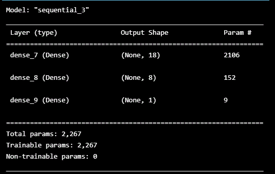
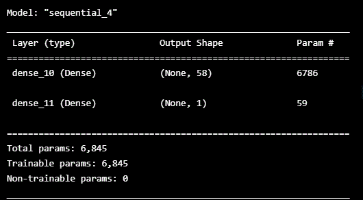
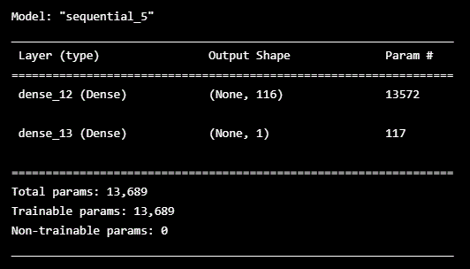

## Venture Funding with Deep Learning
### By: Yen
## Deep Learning
### Contain a tool (venture_funding_with_deep_learning.ipynb) that analyzes whether an applicant will become a successful business. It builds a neural network model using binary cross entropy and data set from Alphabet Soup, a venture capital firm.

With Original Model and 50 epochs, the loss rate is 0.5535597801208496, Accuracy: 0.7331778407096863.

When it was optimized with an increased in hidden layers and 50 epochs, the loss rate is 0.559394359588623, Accuracy: 0.7321282625198364. The loss rate increased slightly and Accuracy rate decreased slightly from the original model. 

When we increased the hidden layers to number of features and 100 epochs, the loss rate is 0.5821748375892639, Accuracy: 0.726064145565033. The loss rate has increased and Accuracy rate has decreased from the original model.

